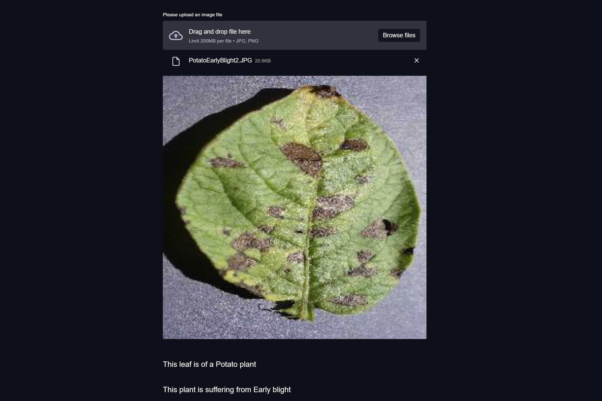

# SurpriseHacks [](https://twitter.com/intent/tweet?text=Wow:&url=https%3A%2F%2Fgithub.com%2FRishit-dagli%2FSurpriseHacks)

[](https://github.com/Rishit-dagli/SurpriseHacks/actions/workflows/flake8-lint.yml)
[](https://plant-disease.tech)
[](https://github.com/Rishit-dagli/SurpriseHacks/stargazers)

[](https://github.com/Rishit-dagli)
[](https://twitter.com/intent/follow?screen_name=rishit_dagli)

This repository demonstrates the process of training a model to identify from a plant leave between 38 diseases and also build a minimalistic web app to identify disease in plant 
leaves from images using the trained model. I use the [PlantVillage dataset](https://arxiv.org/abs/1511.08060) by Hughes et al. consists of about 88,000 healthy and unhealthy leaf 
images divided into 38 categories by species and disease. Here I provide a subset of our experiments on working with this data.

## Example

This image shows an example of using the web-app:



To know more and see a live demo of using the example, you could take a look at this demo video:

[](https://www.youtube.com/watch?v=K8Qy5m_iZ7k)

## Getting started

To get up and running with this example, run the following commands, make sure you have Python installed. In case you want to just test this application you could also use the 
deployed web app [](https://plant-disease.tech)
.

```sh
git clone https://github.com/Rishit-dagli/SurpriseHacks # or clone your own fork
cd SurpriseHacks
pip install -r requirements.txt # install dependencies
streamlit run app.py
```

Your app should now be up and running 🚀.

## Citations

```bib
@misc{hughes2016open,
      title={An open access repository of images on plant health to enable the development of mobile disease diagnostics}, 
      author={David. P. Hughes and Marcel Salathe},
      year={2016},
      eprint={1511.08060},
      archivePrefix={arXiv},
      primaryClass={cs.CY}
}
```
